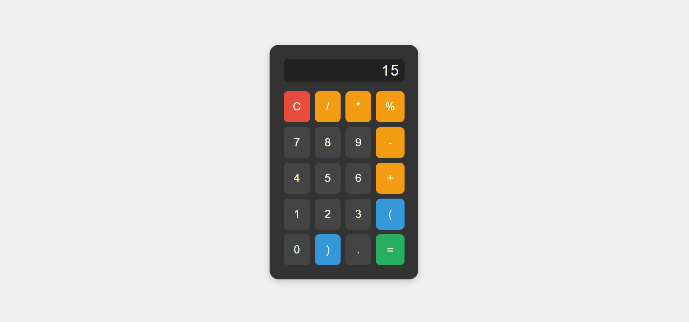
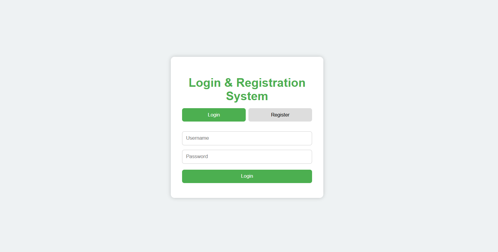
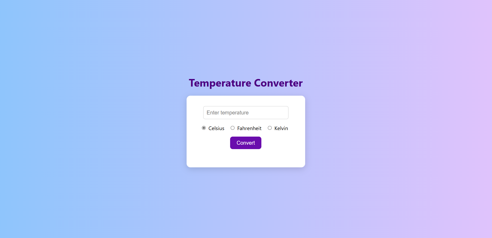
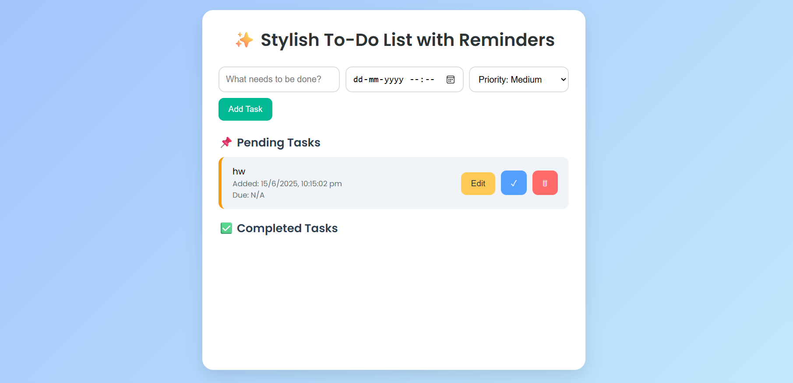
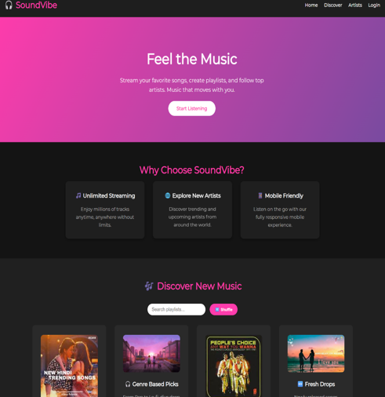
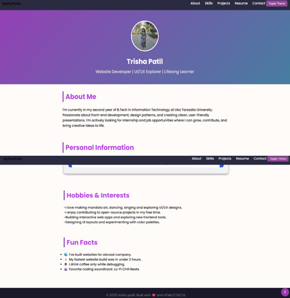
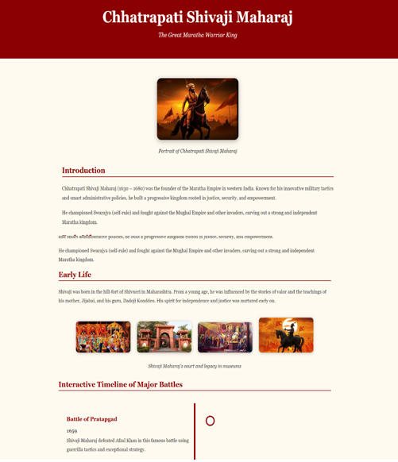

# 💻 Oasis Infobyte – Internship Task

This repository contains a collection of beginner-friendly web development projects completed as part of my internship at **Oasis Infobyte**. These projects demonstrate core front-end development skills such as layout design, form handling, and basic interactivity using **HTML**, **CSS**, and **JavaScript**.

---

## 📂 Project Overview

### 1. 🔢 Calculator
- A basic calculator supporting addition, subtraction, multiplication, and division.
- **Tech used:** HTML, CSS, JavaScript  
<p>
 
</p>

---

### 2. 🔐 Login Form
- A clean and responsive login form interface.
- **Tech used:** HTML, CSS  
- **Screenshot:**  
  <p>
 
</p>

---

### 3. 🌡️ Temperature Converter
- Convert temperatures between Celsius, Fahrenheit, and Kelvin.
- **Tech used:** HTML, CSS, JavaScript  
- **Screenshot:**  
 <p>
 
</p>
---

### 4. 🧩 Web App UI
- A mini web application layout with interactive fields.
- **Tech used:** HTML, CSS, JavaScript  
- **Screenshot:**  
 <p>
 
</p>

---

### 5. 🌐 Landing Page
- A product landing page with a modern design.
- **Tech used:** HTML, CSS  
- **Screenshot:**  
  <p>
 
</p>

---

### 6. 👩‍💼 Personal Portfolio
- A personal portfolio with About, Projects, and Contact sections.
- **Tech used:** HTML, CSS  
- **Screenshot:**  
 <p>
 
</p>

---

### 7. 🕊️ Tribute Page
- A tribute page designed to honor a famous person.
- **Tech used:** HTML, CSS  
- **Screenshot:**  
<p>
 
</p>

---

## 🛠️ Technologies Used

- **HTML5** – Structure and content
- **CSS3** – Styling and layout
- **JavaScript** – Interactivity and logic

---

## ▶️ How to Download and Run

### 🔧 Prerequisites
- A modern web browser (Chrome, Firefox, Edge)

### 📥 Download Steps

#### ✅ Option 1: Download as ZIP
1. Click the green **"Code"** button at the top right of this repository
2. Select **"Download ZIP"**
3. Extract the folder on your system
4. Open any `.html` file in your browser

#### ✅ Option 2: Clone using Git
```bash
git clone https://github.com/TrisHa0510/Oasis-Infobyte-tasks.git
cd Oasis-Infobyte-tasks
